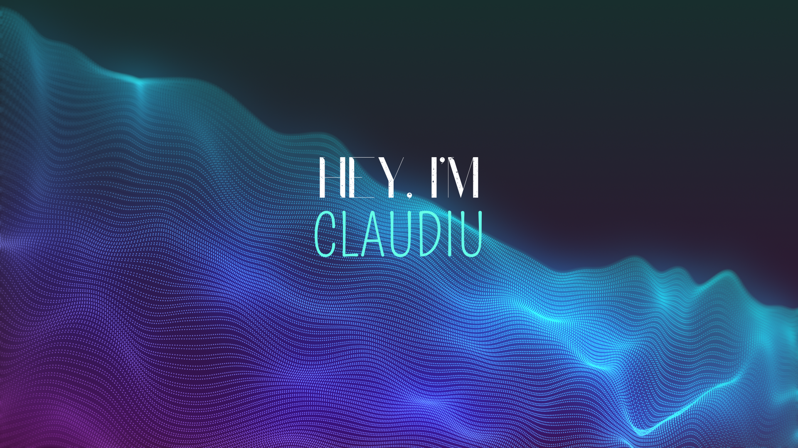

# 💫 About Me:
👋Hello World! I'm Claudiu Cozma  
👨‍💻Solution Engineer in Corporate IT at <a href="https://www.interroll.com/"> Interroll</a>   
🔐Specialized in Microsoft 365, Azure, Security & Compliance, and Digital Workplace solutions  
🛡️Focused on Microsoft Purview, Identity & Access Management, Data Protection, and AI Governance  
🌱Continuously learning and exploring cloud technologies, automation, cybersecurity, and responsible AI  
🚀Passionate about transforming business needs into secure, scalable, and user-centric solutions  

## 🌐 Socials:
 

# 💻 Tech Stack:
         

<!--## 📊 GitHub Stats:
#  
#  
# 
-->

## 🏆 GitHub Trophies
# 

---

<picture>
  <source media="(prefers-color-scheme: dark)" srcset="https://raw.githubusercontent.com/IAmClaudiu/IAmClaudiu/output/github-snake-dark.svg" />
  <source media="(prefers-color-scheme: light)" srcset="https://raw.githubusercontent.com/IAmClaudiu/IAmClaudiu/output/github-snake.svg" />
  
  
</picture>
